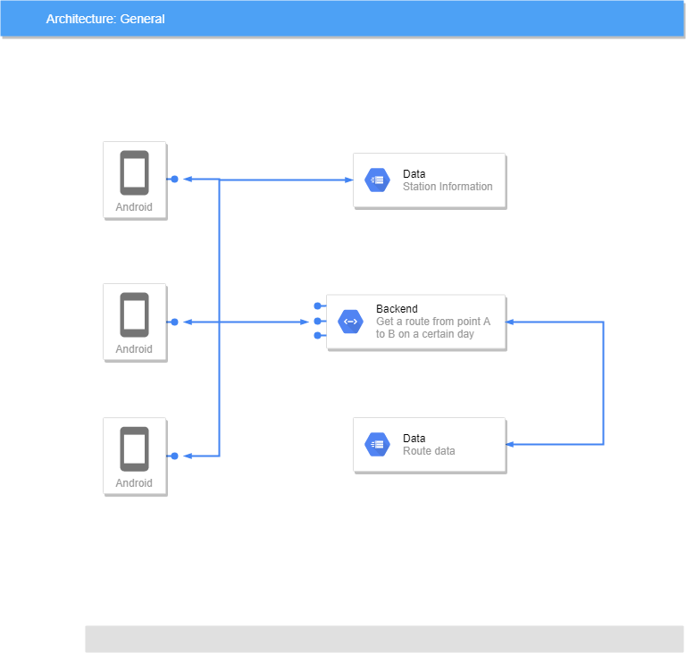

# Taiwan Railway Route Planner 

Plan your train trip on the Taiwan Railway

You can go from any station to an other station without selecting a transfer station. \
We do that for you, just think about you will do during the train ride. \
Sit back and relax.

Supports the following languages:
- Traditional Mandarin
- English
- Korean
- Dutch
- Spanish
- German
- French

More languages coming soon!

### Information

Data provide by [DATA.GOV.TW](https://data.gov.tw/dataset/6138#r1)

The app is open-source check the Github link in the app.

I want also to thank my friends to help translate!

The loading gif in the app comes from [Fayeliew](https://dribbble.com/fayeliew) on Dribbble

# 台灣鐵路路線圖規劃表

計劃您在台灣鐵路的火車之旅

您可以在不選擇轉運站的情況下從任何車站前往其他車站。\
我們為您做到這一點，想想讓您在搭程火車時不用擔心轉程的問題。\
高枕無憂。

支持以下語言：
- 中文
- 英語
- 韓國語
- 荷蘭語
- 西班牙語
- 德語
- 法國人

即將推出更多語言！

### 信息

數據由 [DATA.GOV.TW](https://data.gov.tw/dataset/6138#r1)提供

該應用程序是開源檢查應用程序中的Github鏈接。

我還要感謝我的朋友們幫忙翻譯。

應用程序中的加載GIF來自Dribbble上的 [Fayeliew](https://dribbble.com/fayeliew)

## Download

## Privacy notice

See this link [https://traapp.tk/privacy](https://traapp.tk/privacy)

## Difference between the app and then TRA-Website

- You want to go from station A to station B you don't need to select a transfer, we choose one for you if it's needed.
- Certain routes from us are faster then the TRA-website.
- More routes

Example: 

`Shifen (十分) -> Linrong Shin Kong (林榮新光)` 

Gives on the TRA website 3 possible route.  
On the Taiwan Railway Route Planner you will find 6 routes.

`Chang Jung Christian University (長榮大學) -> Zhuifen (追分)`

Gives no result on the TRA website
On the Taiwan Railway Route Planner you will find many different routes to your destination.

## Architecture of the system

### Explanation

The app sends two types of requests.

1. GET-request
2. POST-request

The GET-request is for getting the station data at the following [link](https://taiwan-railway-route-planner.github.io/TRATimetableData/stationInfo.json). \
The second request the POST-request is for getting a route between 2 stations on a certain day. \
How the backend works is not open source. The backend sends a request to get the all the route data of that day.
By example from [20190915](https://taiwan-railway-route-planner.github.io/TRATimetableData/Schedules/20190915.json)

#### Data

The data comes from [DATA.GOV.TW](https://data.gov.tw/dataset/6138#r1). \
I modify the data a little bit so I can search easier with it. \
The modified data can be found here [TRATimetableData](https://github.com/Taiwan-Railway-Route-Planner/TRATimetableData). \
The unmodified data can be found here [TRAOriginalTimeTable](https://github.com/Taiwan-Railway-Route-Planner/TRAOriginalTimeTable). 

## Questions / Problems

If you have any question / problems just open an issue [this repo Github](https://github.com/Taiwan-Railway-Route-Planner/TRA-app/issues) or email me [support@traapp.tk](mailto:support@traapp.tk).

## Languages 

Currently we support the following languages:

| Native name   | English Name  |
| ------------- | ------------- |
| 中文  | Traditional Chinese  |
| 한국어  | Korean  |
| English  | English  |
| Nederlands  | Dutch  |
| Español | Spanish |
| Deutsch  | German  |
| Française  | French |

If you want to help to make more translations available you can do that follow [this link](https://poeditor.com/join/project/9Aukv8rxJ5). \
If you would rather use Github instead that's also possible All the translations are stored in [this repo](https://github.com/Taiwan-Railway-Route-Planner/TRA_Translations) just open an issue.

Wanted languages are:

| Native name   | English Name  |
| ------------- | ------------- |
| Pilipino  | Filipino  |
| 日本語  | Japanese  |
| ไทย  | Thai  |
| Tiếng việt  | Vietnamese  |

## Thank you very much

I couldn't have created this project without the support and help of the following persons:
* 吳宛玲 Lilly Wu for translating to  中文  (Traditional Chinese)
* Javier Pérez Gómez for translating to Español (Spanish)
* Marvin Plum for translating to Deutsche (German) 